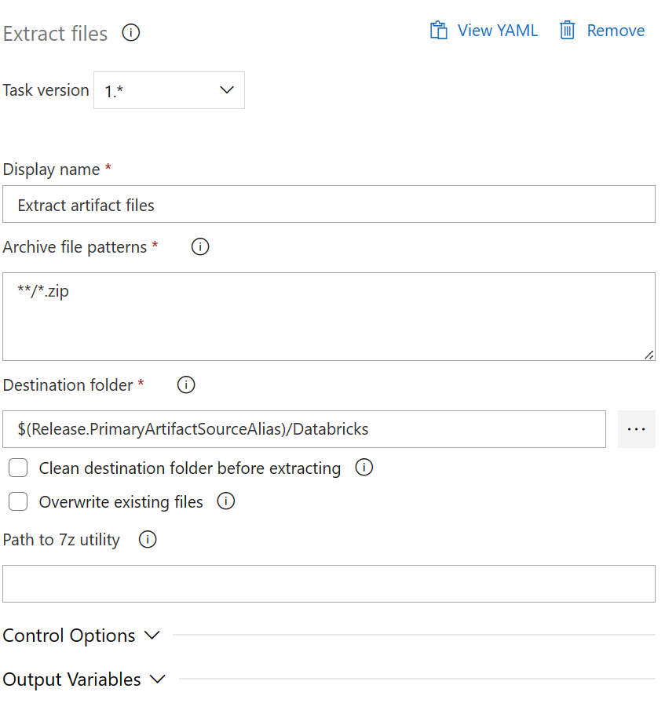

<h1>LAB 2</h1> 

*Goals*

Deploying Azure Databricks resources and artifacts using two different pipelines: two sets of YAML build pipelines, and a classic Release Pipeline.

1. Create your own branch from master and make a GIT clone
2. Deploy your own Databricks resources. 
3. Build Databricks artifacts.
4. Publish artifacts to Databricks.

<h2>Goal 1 - steps:</h2>

1. Navitage to Repos.
2. On the right blade, click on the branch name (master) with a dropdown menu.
3. Click on '+ New Branch'
4. Create a new branch name based on your group name, for example, "dev_group1". Make sure that "based on" has "master" selected.
5. Once the new branch has been created, click on "Clone" in the top right corner.
6. If you're using VSCode, click on the "Clone in VSCode" button. If you're using another IDE, follow the steps to clone the branch for that IDE.
7. Do the changes for following steps in your own branch.  

<h2>Pushing changes to Git</h2>     

1. Save the files you've been working on.
2. In Visual Studio Code, click on "Source control" in the left menu
3. You should see all the changed files in the "Changes" dropdown.
4. When you hover over the files, a "+" icon appears next to it. Clicking on it will move the file to the "staging" area. Click on all the changed files to the staging area.
5. From the top, write a commit message. Try to be as descriptive as possible on what you changed!
6. Next to the blue "Commit button", open the dropdown menu.
7. Click on "Commit & Push"

<h2>Goal 2 - steps:</h2>

``Make sure you're starting to work in your own teams branch``

We are going to create two YAML pipelines - one to create the Databricks resources, and another to build the artifacts. The third pipeline will be 
a classic release pipeline.

<h3>First pipeline - Deploying Databricks</h3>

1. Open ``pipeline-resources.yaml``
2. Change the values in the places marked with comments with corresponding values for your group. 
3. Go back to Azure DevOps GUI.
4. Click on ``Pipelines`` and also the subheading ``Pipelines``.
5. Click on "New Pipeline" on the top right.
- Choose "Azure Repos" as the code location
- Choose the "Module 6" repository
- Select "Existing Azure Pipelines YAML file"
- From the popup, select your branch and your own ``pipeline-resources.yaml`` file from the /Databricks/ folder. Click continue. 
- Click "run" from the top right corner.
6. Let the instructor know you have clicked "run", as the pipeline needs admin permissions to run.
7. Now your resources are deploying, great! 

<h3>Collect information</h3>

After your Databricks resources have been created, we need to collect some information to be used in our build and release pipelines

First, go to the Azure Portal and find your recently created Databricks cluster. Open the resource, and go to ``properties``.

1. Mark down the value of ``Workspace Url``.
2. Mark down the value of ``Workspace ID``.

Then, launch the Databricks workspace from the portal. 

1. Navigate to "Compute" or click on "Create cluster" from the launch page.
2. For the sake of this exercise, keep the defaults in place. 
3. Click "Create cluster".
4. On the opening page, click on the button "JSON" on the right side of the page. 
5. Mark down the value of ``cluster_id``.

We also need to add our service principal privileges to our workspace. You don't need to do this for this lab, but just for your reference!
1. Navigate to Account Management: click the username dropdown on the top right corner and select "Manage Account"
2. Once the management portal opens, click "User management" on the left.
3. Click "Service principals"

<h3>Second pipeline - Databricks artifact build pipeline</h3>

1. Open ``pipeline-build.yaml``
2. You do not have to change anything here - just see what are the steps that the pipeline takes. 
3. Go back to Azure DevOps GUI.
4. Click on ``Pipelines`` and also the subheading ``Pipelines``.
5. Click on "New Pipeline" on the top right.
- Choose "Azure Repos" as the code location
- Choose the "Module 6" repository
- Select "Existing Azure Pipelines YAML file"
- From the popup, select your branch and your own ``pipeline-build.yaml`` file from the /Databricks/ folder. Click continue. 
- Click on "Variables".
- Create new variables like listed below:

| Variable name | Value |
| --- | ----------- |
| DATABRICKS_ADDRESS | Use the value of ``Workspace Url`` you marked down before. Make sure to add ``https://`` to the beginning of the URL! |
| DATABRICKS_ORG_ID | Use the value of ``Workspace ID`` you marked down before. |
| DATABRICKS_PORT | 15001 |
| DATABRICKS_CLUSTER_ID | Use the value of ``cluster_id`` you marked down before. |
| DATABRICKS_API_TOKEN | Create a PAT: https://docs.databricks.com/en/dev-tools/auth/pat.html |

- Click "Save".
- Click "run" from the top right corner.
6. Let the instructor know you have clicked "run", as the pipeline needs admin permissions to run.
7. Now you're Databriks arficats are building. It should not take more than a couple of minutes. 

<h3>Third pipeline</h3>

Finally we will create the classic Release Pipele for deploying our artifacts to Databricks .

1. Navigate to ``Pipelines`` and ``Releases`` underneath it .
2. Click on "+ New" and "New release pipeline"
3. Click "Start with an empty job" to begin. 
4. Follow the steps in the screenshots below .

1. Click on "Add an artifact"
2. Select "Source type" to be "Build"
3. Select your groups build pipeline like in the screenshot.
- You should see the 2 artifacts in the red boxes appear in the text.

1. Select the empty stage you created before and give it a meaningful name.
2. Click on the link that says "1 job, 0 tasks".
3. Click on the large "+" icon next to the "Agent job" text.
4. Add 4 tasks in to the job by searching:
- Use Python version
- Extract Files
- Bash
- Bash

Use the settings in the following screenshots per task:

Destination folder: ``$(Release.PrimaryArtifactSourceAlias)/Databricks``
 
Script: 
``pip install databricks-cli``
``pip install unittest-xml-reporting``

Script: 
databricks workspace import --language=PYTHON --format=SOURCE --overwrite "$(System.ArtifactsDirectory)/$(Release.PrimaryArtifactSourceAlias)/Databricks/notebooks/demonotebook.py" "/Shared/demonotebook.py"

<h3>Define classic variables</h3>
Last: click "Save" from the top right corner.

Before running the Release, we have to define some of the same variables we did for the build pipeline:

| Variable name | Value |
| --- | ----------- |
| DATABRICKS_HOST | Use the value of ``Workspace Url`` you marked down before. Make sure to add ``https://`` to the beginning of the URL! |
| DATABRICKS_CLUSTER_ID | Use the value of ``cluster_id`` you marked down before. |
| DATABRICKS_TOKEN | use the value ``XXXXXXXXXXXXXXXXXXXXXXX`` for this lab. To find out how to create the API Token for your environments, see the documentation here: https://learn.microsoft.com/en-us/azure/databricks/dev-tools/auth#aadt |

Click "Save".

Now you can go to the Pipeline and click on "Create Release". 

Notebooks are not deployed to your Databricks Workspace!

<h3>Extras</h3>

- Achieve the same importing of notebooks task with the marketplace extension.